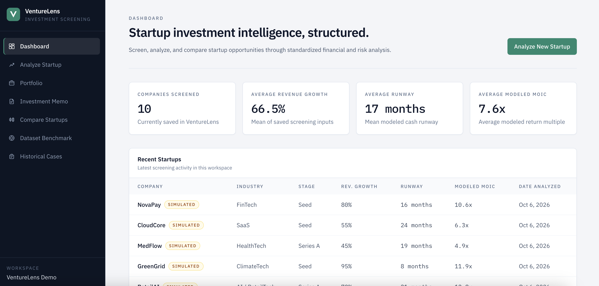
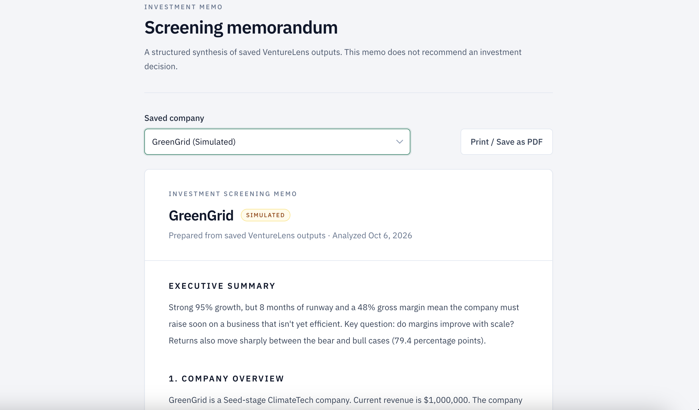
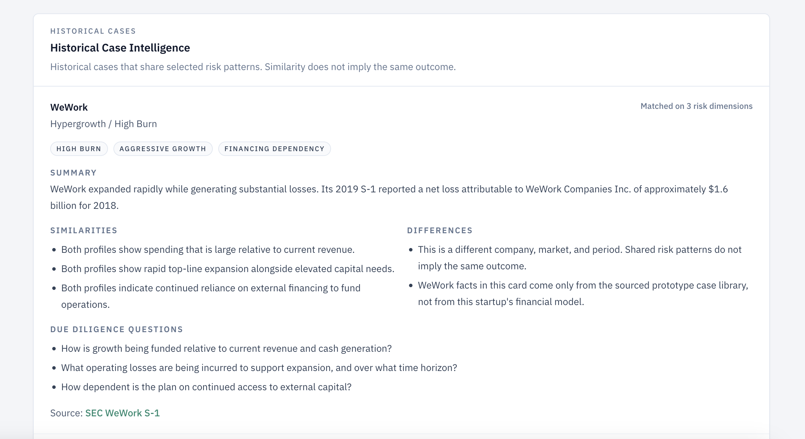

# VentureLens

**Early-stage startup screening: from raw metrics to a first-pass investment memo in minutes.**

🔗 **Live demo:** https://venturelens-chi.vercel.app
*(Click "Load demo dataset" on the dashboard to explore with 10 simulated startups.)*



---

## The problem

Angel investors, student investment clubs, and junior VC analysts screen dozens of startups with the same handful of numbers: revenue, growth, burn, cash, valuation. In practice that screening happens in one-off spreadsheets, so:

- **Assumptions are inconsistent** from one deal to the next, which makes companies hard to compare.
- **Return math gets separated from risk.** A 10x modeled MOIC means little if the company has 8 months of cash.
- **Lessons from past failures aren't applied systematically.** Patterns like the ones behind WeWork or Bird show up in screening data long before the outcome.

VentureLens standardizes that first pass: the same inputs, the same scenario logic, and the same risk rules for every company, plus a written memo that states the main strength, the biggest risk, and the key diligence question.

## What it does

| Feature | What you get |
|---|---|
| **Analyze Startup** | Runway, post-money valuation, ownership before and after dilution, exit value, MOIC, and IRR from a single form |
| **Scenario Analysis** | Bear / Base / Bull cases built around *your* assumptions, editable side by side |
| **Risk Assessment** | Rule-based flags for growth, runway, gross margin, customer concentration, and return sensitivity |
| **Investment Memo** | A structured screening memo with an auto-generated executive summary; printable to PDF |
| **Compare Startups** | Side-by-side metrics plus insights that flag trade-offs (e.g., higher MOIC but lower IRR due to a longer horizon) |
| **Dataset Benchmark** | Each company's metrics against the median of the saved portfolio |
| **Historical Cases** | Matches a company's risk pattern to sourced failure cases (WeWork, Bird, Fast, Airlift) and surfaces diligence questions |




## How it works

**1. Financial engine** (`src/lib/finance/engine.ts`)
- Runway = cash ÷ (annual burn ÷ 12)
- Ownership = investment ÷ post-money, then reduced by expected future dilution
- Exit value = current revenue × (1 + growth)^years × exit revenue multiple
- MOIC = investor exit proceeds ÷ investment; IRR = MOIC^(1/years) − 1

**2. Scenarios** (`src/lib/finance/scenarios.ts`)
Base uses the user's inputs. Bear halves growth, lowers the exit multiple by 2x, and adds 10 points of dilution. Bull raises growth 25%, adds 2x to the multiple, and cuts dilution by 5 points.

**3. Risk flags** (`src/lib/finance/risk.ts`)

| Metric | Positive | Neutral | Caution |
|---|---|---|---|
| Revenue growth | ≥ 50% | 20–50% | < 20% |
| Runway | ≥ 18 months | 12–18 months | < 12 months |
| Gross margin | ≥ 70% | 50–70% | < 50% |
| Largest customer share | < 15% | 15–30% | ≥ 30% |
| Bull–bear IRR spread | < 25 pts | 25–50 pts | ≥ 50 pts |

**4. Historical case matching** (`src/lib/cases/`)
Flags are converted into risk tags (e.g., `runway-risk`, `high-burn`, `weak-capital-efficiency`). A company is matched to a historical case when they share at least two tags. Every match states the similarities, the differences, and that a shared pattern does not imply the same outcome.

## Limitations

This is a screening prototype, not a valuation model. Being explicit about what it doesn't do:

- **Demo data is simulated.** The 10 demo companies are fictional, so the benchmark medians describe the demo set, not the market.
- **Growth is compounded at a constant rate.** Real startups decelerate, so modeled returns at high growth rates are optimistic.
- **Thresholds are not sector-specific.** A 70% gross margin bar fits SaaS but is too strict for fintech, marketplaces, or hardware.
- **The case library is small** (5 cases), so matching illustrates a method rather than producing statistically meaningful results.
- **Data is stored in the browser** (localStorage). Nothing is shared between visitors or devices.

## Roadmap

- Replace user-typed inputs with real fundraising data from public **SEC Form D filings** to identify startups likely to raise their next round
- Sector-specific risk thresholds
- A growth-decay model instead of constant compounding
- An expanded, validated case library that tests whether the flags actually predict outcomes

## Tech stack

Next.js 16 · React 19 · TypeScript · Tailwind CSS 4 · deployed on Vercel

## Run locally

```bash
git clone https://github.com/mwhan99/venturelens.git
cd venturelens
npm install
npm run dev
```

Open http://localhost:3000.

**Validate the financial engine** against a hand-checked reference case (NovaPay):

```bash
npx tsx scripts/novapay-validation.ts
```

---

Built by **Avery Han**, M.S. Management and Analytics, NYU.
